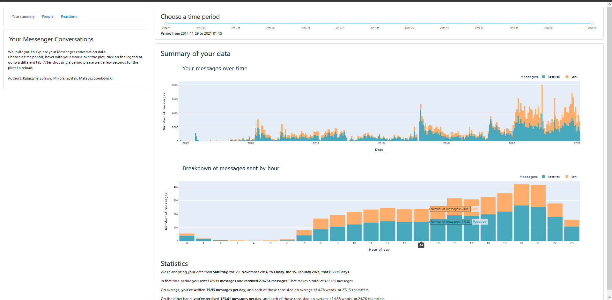

# Some screenshots

# Analiza danych z messengera. Jak uruchomić?

1. Pobrać folder zawierający trzy skrypty: `generate.py`, `plots.py` i `clear_messages_dir.py`, żeby mieć lokalnie
2. Pobrać dane z Facebooka:
    1. -> "Ustawienia"
    2. -> "Twoje infromacje na Facebooku"
    3. -> "Pobieranie twoich infromacji"
    4. wybierz "Wiadomości" i ustaw format JSON (można niską jakość - ma to znaczenie przy zdjęciach i filmach, której w tym dashboardzie nie analizujemy)
    5. utwórz plik (Tworzenie pliku może długo trwać. Facebook wyśle powiadomienie, kiedy plik będzie gotowy.)
3. Paczkę danych z facebooka wypakować do tego samego folderu (to znaczy te skrypty pythonowe powinny być na tym samym poziomie co folder messages)
4. Zainstalować sobie biblioteki pythonowe: na razie korzystam z `dash`, `pandas`, `wordcloud`, `dash_bootstrap_components`. Tu zależy jak macie zainstalowanego, jak normalnie to wystarczy w konsoli `pip install <<nazwa paczki>>`, a jak przez anacondę, to jakoś inaczej.
5. Uruchomić `generate.py`, a pózniej `plots.py`. Stworzy się lokalny serwer z tymi wykresami.
6. W przeglądarce wejść na stronę `http://127.0.0.1:8050/`, przynajmniej u mnie, i powinno działać
7. Można dodatkowo usunąć foldery inne niż wiadomości tekstowe korzystając z `clear_messages_dir.py` (trzeba odkomentować ostatnią linijke, zalecam najpierw sprawdzić czy poprawnie wypisuje ścieżki)
